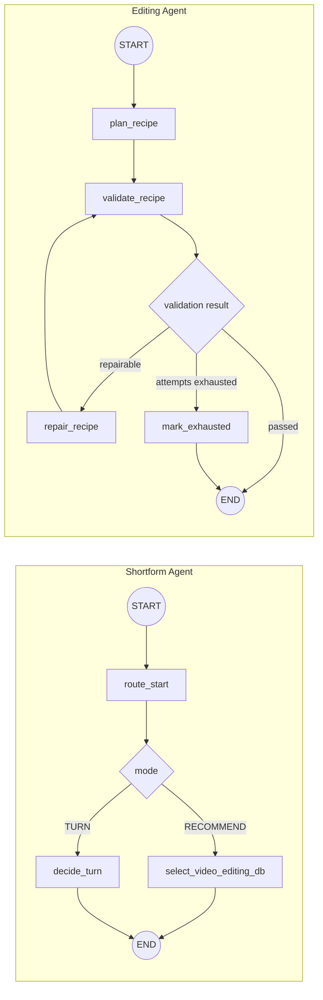

# REALS AI Service

REALS 앱의 숏폼 추천, 촬영 가이드, 영상 편집, 트렌드 데이터를 담당하는 독립 AI 서버입니다.

프론트엔드가 이 서버를 직접 호출하지 않습니다. 앱 요청은 메인 백엔드를 거쳐 전달되며, 모든 내부 API는 `X-Internal-API-Key`로 보호됩니다.

```text
Mobile App
    ↓
Main Backend
    ↓  X-Internal-API-Key
REALS AI Service
    ├─ Challenge Ranking Agent
    ├─ Shortform Recommendation Agent
    ├─ Editing Agent
    ├─ Database Knowledge Manager
    └─ REALS Renderer
```

현재 FastAPI 서비스 버전은 `1.6.0`입니다.

OpenAI를 사용하는 모든 Agent와 Database Knowledge Manager의 기본 모델은 `gpt-4.1-mini`로 통일합니다.

## 현재 구현 상태

| 영역 | 상태 | 현재 역할 |
|---|---|---|
| `challenge-ranking` | `AVAILABLE` | 승인된 트렌드 클러스터 제공, 외부 신호 기반 후보 분석 |
| `shortform` | `AVAILABLE` | 대화로 프로젝트 조건을 수집하고 ACTIVE 영상편집DB 1개 추천 |
| `editing` | `AVAILABLE` | 촬영 영상 분석, EditRecipe 생성·검증, 실제 MP4 렌더링 |
| Database Knowledge Manager | `AVAILABLE` | 상권분석DB·영상편집DB 후보 생성, 검증, 승인, 버전 관리 |
| REALS Renderer | `AVAILABLE` | FFmpeg 기반 세로형 숏폼 렌더링과 결과 QC |

운영 서버는 AWS EC2에서 Docker Compose로 실행합니다. 현재 CPU 운영 프로필은 2 vCPU / 8 GiB 환경을 기준으로 조정되어 있습니다.

## LangGraph 구조

현재 `shortform`과 `editing` Agent의 제어 흐름은 LangGraph `StateGraph`로 구현되어 있습니다. LLM이 데이터베이스를 직접 변경하지 않고, 서비스 계층이 세션·실행 상태를 저장하며 LangGraph는 한 요청 안의 분기와 검증 흐름만 담당합니다.



- `app/agents/shortform/graph.py`: 대화 턴 판단과 영상편집DB 추천 경로 분리
- `app/agents/editing/graph.py`: 레시피 계획, 결정론적 검증, 제한된 자동 수정 반복
- PostgreSQL: 대화 세션, 편집 실행, 결과의 영속 상태 관리
- Celery: 장시간 영상 분석·렌더 작업 실행

LangGraph는 현재 필요한 결정 흐름에만 사용합니다. 챌린지 수집, DB 승인, FFmpeg 렌더링처럼 결정론적 서비스·배치 작업까지 불필요하게 그래프로 감싸지 않습니다.

## 서비스 범위

AI 서버가 담당하는 기능:

- 트렌드 클러스터와 영상 포맷 데이터 제공
- 대화형 숏폼 프로젝트 brief 수집
- 프로젝트 조건에 맞는 영상편집DB 추천
- 템플릿 버전별 촬영 가이드와 촬영 태스크 제공
- 촬영 영상 프레임 분석과 편집 레시피 생성
- REALS Renderer를 통한 최종 MP4 생성
- 게시 문구, 해시태그, CTA 생성
- 상권분석DB와 영상편집DB의 버전·후보·승인 관리
- 비동기 작업 상태와 결과 저장

AI 서버가 담당하지 않는 기능:

- 사용자 로그인과 회원 관리
- 앱 화면과 네비게이션
- 매장·프로젝트·촬영 파일의 메인 도메인 관리
- SNS 계정 로그인 또는 자동 게시
- 프론트엔드와의 직접 통신

## 대화형 숏폼 추천

숏폼 추천 Agent는 `app/agents/shortform/context.md`의 제품 컨텍스트 v2.1을 사용합니다. 후보 부족 처리만 v1.2 정책을 유지합니다.

현재 대화 정책:

- 첫 진입은 `홍보하고 싶은 게 있어요`, `직접 입력하기` 2개
- 구조화 카테고리는 `메뉴`, `가게 공간·분위기`, `이벤트·혜택·할인` 3개
- `사람·브랜드 이야기`, `이용 정보`, `후기·신뢰·전문성`은 구조화 선택지에서 제외
- 한 응답에서는 질문을 하나만 제시
- 필수 정보가 충족되기 전에는 추천하지 않음
- 추천 결과는 한 번에 1개
- 다시 추천할 때는 이미 보여준 템플릿을 제외하고 다음 1개 제공
- 확인되지 않은 메뉴, 가격, 시설, 이벤트 정보를 생성하지 않음

대화 흐름:

```text
세션 생성
  → 홍보 대상·목적·촬영 시간·얼굴 노출 수집
  → 사실 충돌 확인
  → 사용자 최종 확인
  → ACTIVE 영상편집DB 1개 추천
  → 촬영 가이드 조회
```

## 촬영 가이드

추천된 템플릿의 정확한 버전으로 촬영 가이드를 조회합니다.

```http
GET /api/v1/editing-templates/{template_id}/versions/{version}/shooting-guide
X-Internal-API-Key: <INTERNAL_API_KEY>
```

매장명·업종·홍보 대상·목적·메뉴명·얼굴 노출 여부를 query parameter로 함께 전달할 수 있습니다. 저장된 템플릿의 명시적 placeholder만 치환하며 요청마다 LLM을 호출하지 않습니다. `scene_dialogue`는 공백 포함 9자 이하이고 예상 촬영 시간은 최종 장면 길이에서 다시 계산합니다.

정보형 숏폼은 내부의 23개 편집 컷을 사용자에게 노출하지 않고 `shooting_elements`만 반환합니다. 촬영 요소는 최대 5개이며 `instruction`은 공백 포함 50자 이하입니다. 밈·챌린지는 기존 `scenes`/`tasks` 컷 단위 가이드를 유지합니다.

## 영상 편집 파이프라인

```text
촬영 영상 업로드 URL
  → ffprobe 메타데이터 확인
  → 프레임 샘플 추출
  → GPT-4.1 mini 기반 장면·동작 분석
  → 템플릿 근거와 촬영 구간 매칭
  → EditRecipe 생성
  → REALS registry 기반 검증·제한 수정
  → Renderer 호출
  → FFmpeg 렌더링과 QC
  → MP4 URL + 게시 문구 반환
```

정보형은 하나의 긴 촬영 영상에서 여러 비중복 구간을 추출할 수 있습니다. 같은 `video_id`를 여러 편집 컷에 사용할 수 있지만 원본 시간 구간은 겹칠 수 없고, 최종 타임라인은 참조 영상의 편집 컷 순서를 따릅니다.

현재 운영 제한:

| 항목 | 기본값 |
|---|---:|
| 실행당 최대 영상 | 6개 |
| 영상 1개 최대 길이 | 30초 |
| 최종 영상 최대 길이 | 15초 |
| Worker 동시성 | 1 |
| Renderer 타임아웃 | 1,800초 |
| 비디오 소스 | 영상만 지원 |
| 음원 | 렌더링에 삽입하지 않고 게시 플랫폼에서 추가 |

### `SOURCE_GAP` 대응

장면 역할을 완전히 매칭하지 못해도 편집 작업을 결과 없이 끝내지 않습니다.

```text
SOURCE_GAP 감지
  → USE_REDUCED_STRUCTURE로 자동 재계획
  → 재계획 실패 또는 다시 SOURCE_GAP
  → shooting_scene_order 기반 결정론적 기본 레시피 생성
  → 검증
  → 렌더링
  → COMPLETED
```

순서 기반 폴백은 업로드 영상을 촬영 순서대로 정렬하고 각 영상에서 최대 3초를 사용해 단순 컷 편집을 만듭니다. 매칭되지 않은 역할은 `missing_scene_roles`와 `warnings`에 진단 정보로 남지만 렌더링을 중단하지 않습니다.

파일 손상, 최소 컷 길이 미달, 런타임 의존성 장애, Renderer 오류처럼 실제로 결과 생성이 불가능한 경우에는 `FAILED`로 종료합니다. 고아 작업 복구는 기본적으로 비활성화되어 있으며, 운영에서 켜더라도 run당 최대 2회만 재큐잉하고 이후 `FAILED`로 종료합니다.

## 주요 API

모든 `/api/v1` API 요청에는 내부 인증 헤더가 필요합니다.

```http
X-Internal-API-Key: <INTERNAL_API_KEY>
```

루트 호환 헬스 엔드포인트(`/health`, `/health/live`, `/health/ready`)와 `/api/v1/health/ready`는 최소 상태만 공개합니다. API 키·Agent·편집 런타임 상세 정보는 내부 인증이 필요한 `/api/v1/health/diagnostics`에서 확인합니다.

### 시스템

| Method | Endpoint | 설명 |
|---|---|---|
| GET | `/` | 서비스 정보와 주요 링크 |
| GET | `/api/v1/health/live` | API 프로세스 상태 |
| GET | `/api/v1/health/ready` | DB 포함 최소 준비 상태 |
| GET | `/api/v1/health/diagnostics` | Agent, API 키, 편집 런타임 상세 상태(내부 인증) |
| GET | `/api/v1/agents` | 등록된 Agent 목록 |

### 트렌드

| Method | Endpoint | 설명 |
|---|---|---|
| POST | `/api/v1/ranking-runs` | 비동기 랭킹 분석 시작 |
| GET | `/api/v1/ranking-runs/{run_id}` | 분석 진행 상태 |
| GET | `/api/v1/ranking-runs/{run_id}/result` | 실행 시점 고정 결과 |
| GET | `/api/v1/challenges?limit=100` | 현재 승인된 트렌드 결과 |
| GET | `/api/v1/challenges/{id}` | 트렌드 상세 |
| PATCH | `/api/v1/challenges/{id}` | 운영 override 적용 |

### 숏폼 추천과 촬영

| Method | Endpoint | 설명 |
|---|---|---|
| POST | `/api/v1/shortform-sessions` | 추천 대화 세션 생성 |
| POST | `/api/v1/shortform-sessions/{id}/turns` | TEXT·OPTION·CONFIRM 입력 처리 |
| POST | `/api/v1/shortform-sessions/{id}/recommendations/next` | 다음 추천 1개 조회 |
| DELETE | `/api/v1/shortform-sessions/{id}` | 대화 세션 삭제 |
| GET | `/api/v1/editing-templates/{id}/versions/{version}/shooting-guide` | 촬영 가이드 조회 |

### 영상 편집

| Method | Endpoint | 설명 |
|---|---|---|
| POST | `/api/v1/editing-runs` | 비동기 편집 실행 생성 |
| GET | `/api/v1/editing-runs/{id}` | 단계와 진행률 조회 |
| GET | `/api/v1/editing-runs/{id}/result` | 레시피·영상·게시 문구 조회 |
| POST | `/api/v1/editing-runs/{id}/revisions` | 기존 결과 기반 수정 실행 생성 |

### Database Knowledge Manager

| Method | Endpoint | 설명 |
|---|---|---|
| GET | `/api/v1/database-knowledge/sources` | 번들 원본 데이터 조회 |
| GET | `/api/v1/database-knowledge/databases` | 활성 DB 버전 조회 |
| GET | `/api/v1/database-knowledge/candidates` | 변경 후보와 검증 상태 조회 |
| POST | `/api/v1/database-knowledge/trade-area-db/candidates` | 상권분석DB 후보 생성 |
| POST | `/api/v1/database-knowledge/video-editing-db/candidates` | 영상편집DB 후보 생성 |
| POST | `/api/v1/database-knowledge/candidates/{id}/validate` | 후보 검증 |
| POST | `/api/v1/database-knowledge/candidates/{id}/approve` | 후보 승인·적용 |
| POST | `/api/v1/database-knowledge/candidates/{id}/reject` | 후보 거절 |
| GET | `/api/v1/database-knowledge/runs/{id}` | 후보 생성 작업 상태 |
| GET | `/api/v1/database-knowledge/runs/{id}/result` | 후보 생성 작업 결과 |

전체 요청·응답 계약은 [백엔드 연동 문서](docs/BACKEND_INTEGRATION.md)를 참고하세요.

## 편집 요청 예시

```http
POST /api/v1/editing-runs
X-Internal-API-Key: <INTERNAL_API_KEY>
Content-Type: application/json

{
  "project": {
    "project_id": "45",
    "store_id": "store_123",
    "promotion_subject": {
      "type": "MENU",
      "name": "시그니처 라떼"
    },
    "promotion_objective": "awareness",
    "face_exposure": "not_allowed"
  },
  "selected_shortform": {
    "recommendation_id": "rec_123",
    "editing_template_id": "cafe_recommendation_reels",
    "editing_template_version": 3
  },
  "videos": [
    {
      "video_id": "task_1",
      "footage_url": "https://example.com/task-1.mp4",
      "shooting_scene_order": 1
    }
  ]
}
```

생성 응답은 `202 Accepted`입니다. 백엔드는 상태 API를 polling하고 `COMPLETED`가 되면 결과 API를 조회합니다.

## 로컬 실행

### Docker Compose

```bash
cp .env.example .env
# .env에 INTERNAL_API_KEY와 필요한 외부 API 키 입력
docker compose up -d --build
```

실행 서비스:

- FastAPI: `http://localhost:8000`
- Swagger UI: `http://localhost:8000/docs`
- REALS Renderer: `http://localhost:8080`
- PostgreSQL 17
- Redis 7
- Celery Worker
- Celery Beat

상태 확인:

```bash
curl http://localhost:8000/health
curl http://localhost:8000/api/v1/health/diagnostics \
  -H "X-Internal-API-Key: $INTERNAL_API_KEY"
docker compose ps
```

### Python 개발 환경

```bash
python -m venv .venv
source .venv/bin/activate
# Windows PowerShell: .\.venv\Scripts\Activate.ps1

pip install -e ".[dev]"
cp .env.example .env
alembic upgrade head
uvicorn app.main:app --reload
```

검사:

```bash
ruff check .
pytest -q
```

## 환경변수

필수 또는 주요 환경변수:

```dotenv
INTERNAL_API_KEY=replace-with-a-long-random-value
DATABASE_URL=postgresql+psycopg://challenge:challenge@db:5432/challenge
REDIS_URL=redis://redis:6379/0

OPENAI_API_KEY=
APIFY_API_TOKEN=
GEMINI_API_KEY=
YOUTUBE_API_KEY=
NAVER_API_HUB_CLIENT_ID=
NAVER_API_HUB_CLIENT_SECRET=

EDITING_RENDERER_URL=http://renderer:8080
RENDERER_PUBLIC_BASE_URL=http://localhost:8080
```

전체 기본값은 [`.env.example`](.env.example)에 있습니다. 실제 `.env`, API 키, 사용자 영상, 렌더 결과와 모델 가중치는 Git에 커밋하지 않습니다.

OpenAI 잔액이 소진되면 추천·편집 요청은 provider의 `429 insufficient_quota`를 명확한 오류로 반환합니다. `/api/v1/health/diagnostics`의 `openai: true`는 키 설정 여부와 런타임 구성을 뜻하며 계정 잔액을 보장하지 않습니다.

## AWS 운영

현재 운영 구조:

```text
AWS EC2
└─ AI service checkout
   ├─ api:8000
   ├─ renderer:8080
   ├─ worker
   ├─ beat
   ├─ postgres
   └─ redis
```

배포는 AWS Systems Manager Run Command를 통해 EC2에서 다음 순서로 수행합니다.

1. `origin/main` fetch 및 fast-forward
2. Docker 이미지 재빌드
3. Compose 서비스 재생성
4. `/health`와 `/api/v1/health/ready` 확인
5. 서버 HEAD와 GitHub `main` 커밋 비교

API 키는 저장소가 아니라 AWS Systems Manager Parameter Store와 서버 환경변수로 관리합니다. 메인 백엔드는 VPC 내부 AI 서버 URL과 동일한 `INTERNAL_API_KEY`를 사용합니다.

## 프로젝트 구조

```text
app/
├─ agents/
│  ├─ challenge_ranking/
│  ├─ shortform/
│  └─ editing/
├─ api/v1/
├─ renderer/
├─ template_knowledge/
├─ ranker_core/
├─ workers/
├─ models/
├─ schemas/
└─ services/

reals-video-engine/
├─ reals_edit_engine/
├─ registry/
├─ demo/
└─ tools/
```

## 운영상 주의사항

- 백엔드는 최소 준비 확인에 `/api/v1/health/ready`, 운영 진단에 인증된 `/api/v1/health/diagnostics`를 사용합니다.
- `200/202` 응답만으로 최종 영상 생성이 완료된 것은 아닙니다. 비동기 실행의 `status`, `stage`, `progress`, `queue_position`, `estimated_wait_sec`를 확인해야 합니다.
- 편집 결과 URL은 백엔드만 접근하며 `/files/...` 요청에도 `X-Internal-API-Key`가 필요합니다.
- `SOURCE_GAP`은 내부 LLM 결정 스키마에 남아 있지만 신규 편집 실행은 자동 축소·순서 기반 폴백으로 렌더링을 계속합니다.
- 자동 수집 데이터와 플랫폼 사용 정책은 운영 전에 별도로 검토해야 합니다.

## 문서

- [아키텍처와 서비스 경계](docs/ARCHITECTURE.md)
- [메인 백엔드 연동 계약](docs/BACKEND_INTEGRATION.md)
- [Database Knowledge Manager](docs/DATABASE_KNOWLEDGE_MANAGER.md)
- [저장소와 실행 이력 보존 정책](docs/STORAGE_RETENTION.md)
- [새 Agent 추가 방법](docs/ADDING_AN_AGENT.md)
- [REALS 영상 편집 엔진](reals-video-engine/README.md)
